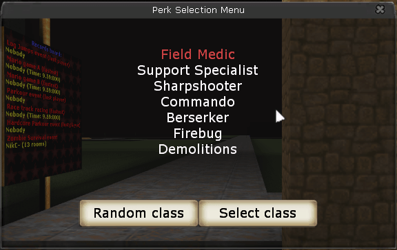

[cosmetic fixes]: https://forums.tripwireinteractive.com/index.php?threads/kfmodsperkreplacement1011-level-6.38882/
[arramus]: https://www.moddb.com/members/arramus
[sinnerg]: https://forums.tripwireinteractive.com/index.php?members/sinnerg.15399/

# Perk Replacement

[](https://github.com/InsultingPros/KFModsPerkReplacement1012/releases)

> **Note**: This mod is uploaded for historical reasons and to provide up-to-date, validated files for download.

Allows you to pick perks with desired levels on respawn. All I added:

- Separate [config file](Configs/KFModsPerkReplacement.ini), to keep things clean.
- Much cleaner code.
- New menu.
- No more class hardcode, to make modifications easier.



## Installation

```cpp
KFModsPerkReplacement1012.MutPerkReplacement
```

## Building and Dependencies

Use [KF Compile Tool](https://github.com/InsultingPros/KFCompileTool) for easy compilation.

```cpp
EditPackages=KFModsPerkReplacement1012
```

## Credits

- [sinnerg] - author of the original version.
- [arramus] - made few [cosmetic fixes].
